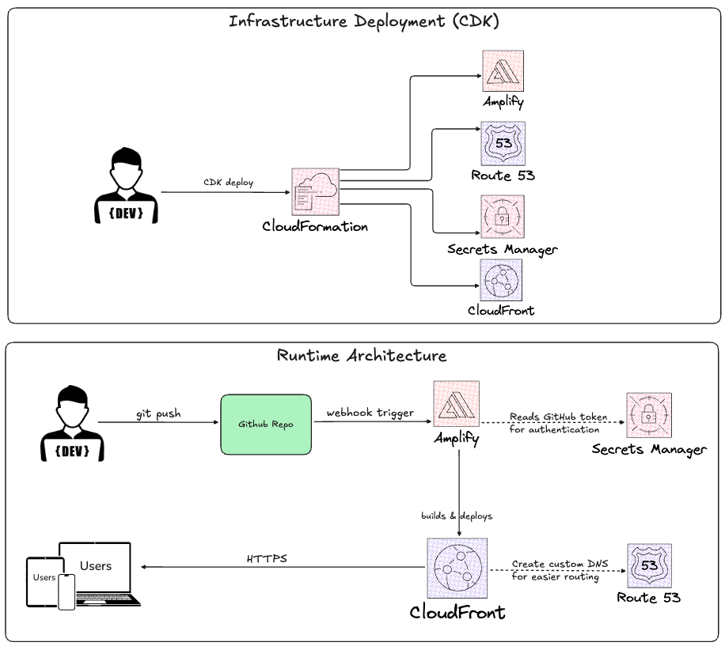

# Alan Le - Portfolio Website

A modern, responsive portfolio website built with Next.js and deployed on AWS Amplify with automated CI/CD.

🌐 **Live Site:** [elnala.com](https://elnala.com)

## Architecture



### Tech Stack
- **Frontend:** Next.js, React, TypeScript, Tailwind CSS, shadcn/ui
- **Hosting:** AWS Amplify with CloudFront CDN
- **CI/CD:** Automated deployments via GitHub webhooks
- **Infrastructure:** AWS CDK (TypeScript)
- **DNS:** Route 53 (custom domain)
- **Secrets:** AWS Secrets Manager (GitHub token)

### How It Works

**Infrastructure Deployment (one-time):**
1. Developer runs `cdk deploy` from local machine
2. CloudFormation creates all AWS resources (Amplify, Route 53, Secrets Manager, CloudFront)

**Runtime Flow:**
1. Developer pushes code to GitHub
2. GitHub webhook triggers Amplify build
3. Amplify pulls code (authenticates via Secrets Manager)
4. Amplify builds and deploys to CloudFront
5. Users access site through CloudFront CDN at elnala.com

## Features

- Dark theme responsive design
- Automated deployments on every push to main branch
- Infrastructure as Code using AWS CDK
- Secure credential management with AWS Secrets Manager
- Global content delivery via CloudFront
- Custom domain with SSL certificate

## Local Development
```bash
npm install
npm run dev
```

Open [http://localhost:3000](http://localhost:3000) to view the site.

## Project Structure
```
project3-portfolio/
├── portfolio/                    # Next.js frontend
│   ├── src/app/                  # Source code
│   ├── public/                   # Static assets
│   └── architecture/             # Architecture diagrams
└── portfolio-infrastructure/     # CDK infrastructure code
```

## Author

**Alan Le** - Cloud Engineer

| Platform | Link |
|----------|------|
| Website | [elnala.com](https://elnala.com) |
| LinkedIn | [linkedin.com/in/alantommyle](https://linkedin.com/in/alantommyle) |
| GitHub | [github.com/elnala24](https://github.com/elnala24) |
| Medium | [medium.com/@elnala24](https://medium.com/@elnala24) |